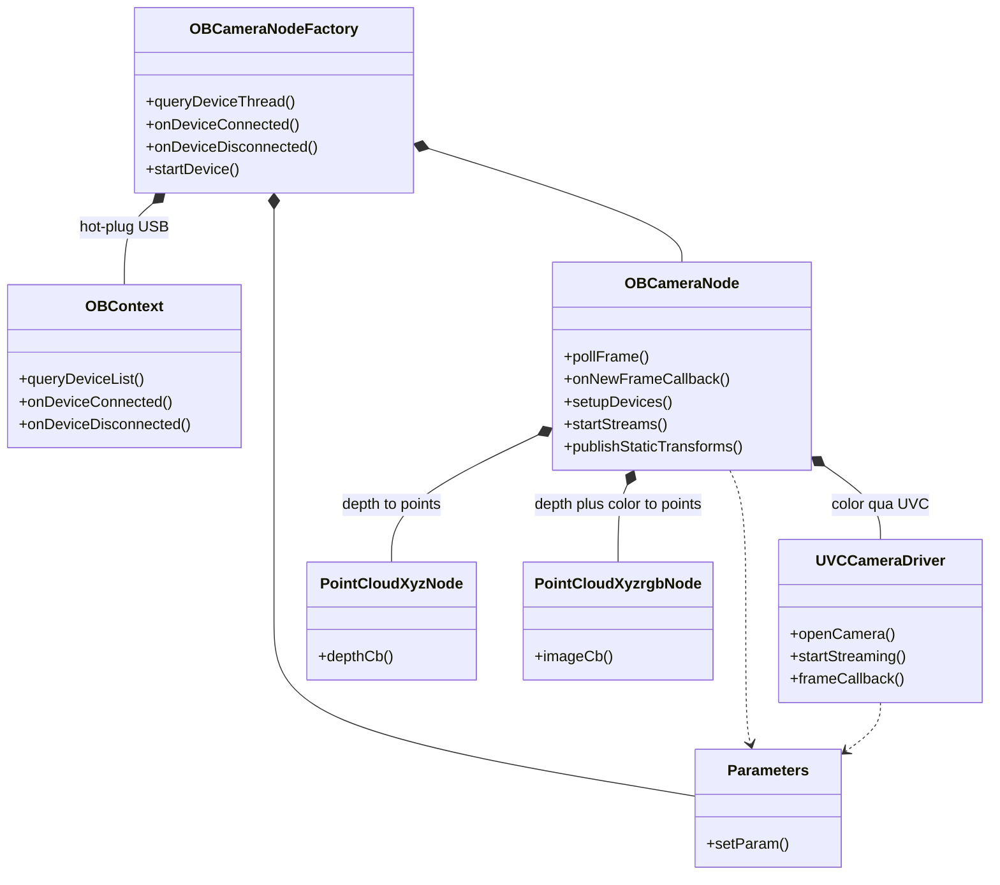

# `ros2_astra_camera` trên ROS 2 Jazzy — Astra Pro

Tài liệu kỹ thuật: kiến trúc lớp, luồng dữ liệu depth/color từ phần cứng lên ROS 2, cơ chế
timestamp & đồng bộ, tham số, và danh sách thay đổi đã thực hiện để port sang **ROS 2 Jazzy /
Ubuntu 24.04**.

Mọi tham chiếu mã nguồn dạng `file:line` theo trạng thái repo **sau khi port**.

---

## Mục lục

1. [Astra Pro nhìn từ phía phần cứng](#1-astra-pro-nhìn-từ-phía-phần-cứng)
2. [Kiến trúc các lớp](#2-kiến-trúc-các-lớp)
3. [Luồng dữ liệu depth](#3-luồng-dữ-liệu-depth-openni2)
4. [Luồng dữ liệu color](#4-luồng-dữ-liệu-color-uvc)
5. [Timestamp và đồng bộ thời gian](#5-timestamp-và-đồng-bộ-thời-gian)
6. [Topic / service / TF](#6-topic--service--tf)
7. [Tham số](#7-tham-số-quan-trọng)
8. [Những gì đã đổi để chạy trên Jazzy](#8-những-gì-đã-đổi-để-chạy-trên-jazzy)
9. [Build và chạy](#9-build-và-chạy)
10. [Cạm bẫy đã biết](#10-cạm-bẫy-đã-biết)

---

## 1. Astra Pro nhìn từ phía phần cứng

Điểm mấu chốt chi phối toàn bộ phần còn lại: **Astra Pro là hai thiết bị USB độc lập trong một vỏ**.

```
                      ┌──────────────────────── Astra Pro ────────────────────────┐
                      │                                                            │
  IR projector ─────► │  Cảm biến depth/IR          │        Cảm biến RGB          │
  IR camera    ─────► │  (ASIC tính depth)          │        (sensor màu)          │
                      │         │                   │             │                │
                      │         ▼                   │             ▼                │
                      │  Giao thức riêng Orbbec     │      Giao thức UVC chuẩn     │
                      │  (VID:PID 2bc5:0403…)       │      (VID:PID 2bc5:0501)     │
                      └─────────┬───────────────────┴─────────────┬────────────────┘
                                │ USB endpoint A                  │ USB endpoint B
                                ▼                                 ▼
                       libOpenNI2 + liborbbec.so              libuvc (libusb)
```

Hệ quả bắt buộc phải nhớ:

- `use_uvc_camera=true` (mặc định trong `astra_pro.launch.xml:49`).
- Ảnh màu **không** đi qua OpenNI ⇒ mọi service `set_color_*` / `get_color_*` (vốn nói chuyện với
  sensor màu qua OpenNI) **không có tác dụng**. Phải dùng bản `*_uvc_*`.
- Hai luồng có đồng hồ riêng, đường USB riêng, thread riêng. Đây là gốc rễ của toàn bộ mục 5.

---

## 2. Kiến trúc các lớp

### 2.1 Sơ đồ lớp

```
                    ┌──────────────────────────────────────────────────────┐
                    │  OBCameraNodeFactory   « rclcpp::Node »              │
                    │  node: astra_camera_node                             │
                    │  ─ dò/mở thiết bị USB, hot-plug, semaphore đa camera │
                    └───┬──────────────────┬──────────────────┬────────────┘
                        │ sở hữu           │ sở hữu           │ sở hữu
                        ▼                  ▼                  ▼
              ┌──────────────────┐  ┌─────────────┐  ┌────────────────────┐
              │    OBContext     │  │ Parameters  │  │    OBCameraNode    │
              │ listener OpenNI  │  │ tham số     │  │ depth + IR + TF    │
              │ connect/disconn. │  │ động        │  │ + services         │
              └──────────────────┘  └─────────────┘  └─────────┬──────────┘
                                           ▲                   │ sở hữu
                                           │ dùng      ┌───────┼────────────────┐
                                           │           ▼       ▼                ▼
                                           │  ┌───────────────┐ ┌────────────┐ ┌───────────────────┐
                                           └──┤UVCCameraDriver│ │PointCloud  │ │PointCloudXyzrgb   │
                                              │ color qua UVC │ │XyzNode     │ │Node               │
                                              │ thread libuvc │ │depth→points│ │depth+color→points │
                                              └───────────────┘ └────────────┘ └───────────────────┘
```

Cùng nội dung dưới dạng mermaid (render trên GitHub / VS Code có extension mermaid):



Toàn bộ các lớp trên sống **trong một tiến trình, một `rclcpp::Node` duy nhất** tên
`astra_camera_node`. `PointCloudXyzNode`/`PointCloudXyzrgbNode` **không phải** node ROS riêng —
chúng chỉ là lớp C++ giữ publisher/subscriber trên cùng node đó
([ob_camera_node.cpp:29-32](../astra_camera/src/ob_camera_node.cpp#L29-L32)).

### 2.2 Bản đồ file

| Lớp | File | Trách nhiệm |
|---|---|---|
| `OBCameraNodeFactory` | `src/ob_camera_node_factory.cpp` | Vòng đời USB, hot-plug, chọn thiết bị theo serial, semaphore `/dev/shm` cho đa camera |
| `OBContext` | `src/ob_context.cpp` | Bọc listener connect/disconnect của OpenNI2 |
| `OBCameraNode` | `src/ob_camera_node.cpp` | Stream depth/IR, camera_info, TF, thread `pollFrame` |
| `OBCameraNode` (services) | `src/ros_service.cpp` | ~30 service điều khiển |
| `OBCameraNode` (calib) | `src/ob_camera_info.cpp` | Đọc tham số nội/ngoại từ firmware |
| `UVCCameraDriver` | `src/uvc_camera_driver.cpp` | Toàn bộ đường màu qua libuvc |
| Point cloud | `src/point_cloud_proc/*.cpp` | Sinh `depth/points`, `depth/color/points` |
| `Parameters` | `src/dynamic_params.cpp` | Khai báo tham số + callback runtime |
| Compat | `include/astra_camera/compat/*.h` | Chọn header `.h`/`.hpp` theo distro (xem mục 8) |

### 2.3 Thứ tự khởi tạo

```
main()                                   src/main.cpp
 └─ OBCameraNodeFactory()                factory:23
     ├─ openni::OpenNI::initialize()
     ├─ OBContext()                      đăng ký listener USB
     └─ queryDeviceThread()              [thread] dò thiết bị mỗi 100 ms
         └─ onDeviceConnected()
             └─ device->open(uri)
                 └─ startDevice() ──► OBCameraNode()          ob_camera_node.cpp:37
                                       └─ init()               ob_camera_node.cpp:20
                                           ├─ setupConfig()      tên stream, pixel format
                                           ├─ setupTopics()
                                           │   ├─ getParameters()
                                           │   ├─ setupDevices()        tạo VideoStream (bỏ qua COLOR khi UVC)
                                           │   ├─ setupCameraCtrlServices()
                                           │   ├─ setupPublishers()
                                           │   ├─ getCameraParams()     đọc calib từ firmware
                                           │   ├─ setupUVCCamera() ──► UVCCameraDriver()  ← mở /dev/bus/usb
                                           │   └─ publishStaticTransforms()
                                           ├─ startStreams()
                                           │   ├─ setImageRegistrationMode()   D2C
                                           │   ├─ setDepthColorSync()
                                           │   ├─ stream->start()  (depth, ir)
                                           │   └─ uvc_start_streaming()        (color)
                                           ├─ [thread] pollFrame()
                                           ├─ PointCloudXyzNode()
                                           └─ PointCloudXyzrgbNode()
```

---

## 3. Luồng dữ liệu depth (OpenNI2)

```
 ┌─────────────┐   IR pattern    ┌──────────────┐  USB bulk   ┌────────────────┐
 │ IR projector│ ──────────────► │ Cảm biến IR  │ ──────────► │ liborbbec.so   │
 └─────────────┘                 │ + ASIC depth │             │ + libOpenNI2   │
                                 └──────────────┘             └───────┬────────┘
                                  (depth tính trong             hàng đợi frame
                                   firmware camera)             của OpenNI
                                                                      │
   ┌──────────────────────────────────────────────────────────────────┘
   │  [thread pollFrame]  ob_camera_node.cpp:70
   ▼
 waitForAnyStream(streams[], &ready, 2000ms)         :97   ◄── trả về ĐÚNG MỘT stream
   │                                                           (any, không phải all)
   ▼
 readFrame(&frame)                                   :103
   │
   ▼
 onNewFrameCallback(frame, DEPTH)                    :518
   ├─ image.data = frame.getData()      (không copy, trỏ thẳng buffer OpenNI)
   ├─ cv::resize nếu depth_scale_ > 1                :531
   ├─ cv_bridge::CvImage(...).toImageMsg()           :535
   ├─ header.stamp = node_->now()   ◄── ĐỒNG HỒ HOST :539
   ├─ header.frame_id = depth_registration_ ? camera_color_optical_frame
   │                                        : camera_depth_optical_frame
   ├─ publish  /camera/depth/image_raw                :547
   └─ publish  /camera/depth/camera_info
```

Đặc điểm cần nắm:

- Vòng lặp là **một thread duy nhất** phục vụ cả depth lẫn IR. Mỗi vòng chỉ đọc một frame của
  một stream, publish xong mới quay lại chờ.
- `frame.getData()` được gán trực tiếp vào `cv::Mat` (zero-copy), nhưng `toImageMsg()` sau đó
  copy sang message. Buffer OpenNI chỉ hợp lệ trong phạm vi callback.
- **Không có hàng đợi ghép cặp**: depth ra ROS ngay khi đọc xong.

---

## 4. Luồng dữ liệu color (UVC)

```
 ┌──────────────┐   MJPEG frame   ┌──────────────┐          ┌──────────────────┐
 │  Sensor RGB  │ ──────────────► │  USB (UVC)   │ ───────► │ libuvc / libusb  │
 └──────────────┘                 └──────────────┘          └────────┬─────────┘
                                                                     │
                                          [thread riêng của libuvc]  │
                                                                     ▼
                                       frameCallbackWrapper()   uvc_camera_driver.cpp:411
                                                                     │
                                                                     ▼
                                       frameCallback(frame)          :338
   ┌─────────────────────────────────────────────────────────────────┘
   ├─ header.stamp = node_->now()   ◄── ĐỒNG HỒ HOST, lấy TRƯỚC khi giải nén :347
   ├─ uvc_mjpeg2rgb()  giải nén MJPEG → rgb8   (~vài ms CPU)          :370
   ├─ crop ROI nếu color_roi_* được đặt  → stamp bị GÁN LẠI           :395
   ├─ lật ảnh nếu uvc_flip
   ├─ publish  /camera/color/image_raw                                :404
   └─ publish  /camera/color/camera_info  (stamp copy từ ảnh)         :406
```

Lưu ý: nếu bật `color_roi_*`, timestamp bị ghi đè **sau** khi crop
([uvc_camera_driver.cpp:395](../astra_camera/src/uvc_camera_driver.cpp#L395)), tức trễ thêm phần
thời gian giải nén + crop. Không bật ROI nếu bạn quan tâm độ chính xác timestamp.

---

## 5. Timestamp và đồng bộ thời gian

### 5.1 Câu trả lời ngắn

> **Depth và color KHÔNG được lấy đồng bộ theo frameset.** Không có frameset ở bất kỳ tầng nào:
> không ở phần cứng, không ở driver, không ở message. Đồng bộ duy nhất là **xấp xỉ theo timestamp,
> ở phía dưới (downstream)**, và timestamp đó là **thời điểm phần mềm nhận được frame**, không phải
> thời điểm phơi sáng.

### 5.2 Vì sao — ba tầng đều không đồng bộ

**Tầng 1 — API.** OpenNI2 chỉ có `waitForAnyStream()`
([ob_camera_node.cpp:97](../astra_camera/src/ob_camera_node.cpp#L97)): trả về **một** stream sẵn
sàng. Không có khái niệm `FrameSet` như Orbbec SDK v2 (`pipeline.waitForFrames()`). Ngay cả depth và
IR — cùng đi qua OpenNI, cùng một thread — cũng được publish rời rạc.

**Tầng 2 — đường truyền.** Color không đi qua OpenNI mà qua libuvc, trên **thread khác, USB endpoint
khác**. Driver không hề có chỗ nào ghép hai luồng này lại.

**Tầng 3 — timestamp.** Cả hai đường đều dùng `node_->now()`:

| | Vị trí gán stamp | Giá trị |
|---|---|---|
| Depth / IR | [ob_camera_node.cpp:539](../astra_camera/src/ob_camera_node.cpp#L539) | `node_->now()` khi thread poll đã đọc xong frame |
| Color | [uvc_camera_driver.cpp:347](../astra_camera/src/uvc_camera_driver.cpp#L347) | `node_->now()` khi libuvc gọi callback |

`openni::VideoFrameRef::getTimestamp()` (timestamp µs theo đồng hồ thiết bị) **không được dùng**.
Nghĩa là stamp mang toàn bộ jitter của: truyền USB, lịch trình thread OS, tải CPU, và (với color)
thứ tự gọi callback của libuvc.

### 5.3 Sơ đồ thời gian

```
 thời gian ──────────────────────────────────────────────────────────────────────►

 Phơi sáng depth   ▐███▌                    ▐███▌                    ▐███▌
 Phơi sáng color     ▐██▌                     ▐██▌                     ▐██▌
                       ╲                        ╲                        ╲
 USB + xử lý            ╲  (jitter, MJPEG decode)╲                        ╲
                         ╲                        ╲                        ╲
 stamp depth  ────────────●───────────────────────●────────────────────────●
 stamp color  ──────────────●───────────────────────●──────────────────────●
                            ↑
                     Δt KHÔNG xác định, KHÔNG bị chặn trên.
                     Thực tế thường vài ms → vài chục ms, có thể vượt 1 chu kỳ
                     khung hình (33 ms @30 fps) khi CPU tải nặng.
```

### 5.4 `color_depth_synchronization` — vô nghĩa với Astra Pro

Tham số này gọi `device_->setDepthColorSyncEnabled()`
([ob_camera_node.cpp:569-570](../astra_camera/src/ob_camera_node.cpp#L569-L570)) — đồng bộ phơi sáng
ở tầng firmware giữa depth và **color stream của OpenNI**. Astra Pro lấy color qua UVC nên lệnh này
không chạm được tới cảm biến RGB. Mặc định trong launch cũng là `false`.

### 5.5 Đồng bộ thực sự tồn tại: `message_filters` trong point cloud màu

Chỗ duy nhất trong gói này có đồng bộ là `PointCloudXyzrgbNode`
([point_cloud_xyzrgb.cpp:72-83](../astra_camera/src/point_cloud_proc/point_cloud_xyzrgb.cpp#L72-L83)):

```
 /camera/depth/image_raw ────┐
 /camera/color/image_raw ────┼──► ApproximateTime<Image, Image, CameraInfo>  (queue = 5)
 /camera/color/camera_info ──┘         │
                                       ▼
                              imageCb()  :134
                                       ├─ kiểm tra frame_id khớp nhau   :138
                                       ├─ resize color nếu khác kích thước depth
                                       └─ publish /camera/depth/color/points
```

- Mặc định `ApproximateTime`; tham số `use_exact_sync=true` chuyển sang `ExactTime` —
  **đừng bật**, vì hai stamp lấy từ hai lần đọc đồng hồ khác nhau nên không bao giờ bằng nhau,
  point cloud màu sẽ đứng im.
- `PointCloudXyzNode` chỉ dùng depth + depth camera_info, không liên quan color.

### 5.6 Phân biệt hai loại "đồng bộ"

| Loại | Cơ chế trong gói | Tham số | Có hoạt động trên Astra Pro? |
|---|---|---|---|
| **Không gian** (pixel depth ↔ pixel color) | Hardware D2C trong firmware, dùng calib nội bộ | `depth_registration` | ✅ Có |
| **Thời gian** (frame depth ↔ frame color cùng thời điểm) | Không có ở driver; chỉ `ApproximateTime` ở downstream | — | ⚠️ Chỉ xấp xỉ |

`depth_registration=true` khiến ảnh depth được căn về hệ pixel của camera màu và `frame_id` đổi
thành `camera_color_optical_frame`
([ob_camera_node.cpp:541-542](../astra_camera/src/ob_camera_node.cpp#L541-L542)). Đây là căn chỉnh
**hình học**, hoàn toàn độc lập với thời gian.

### 5.7 Khuyến nghị thực tế cho robot

1. **Ở node tiêu thụ của bạn**, luôn dùng `message_filters::sync_policies::ApproximateTime` với
   slop ≈ nửa đến một chu kỳ khung hình (15–35 ms @30 fps). Đừng giả định stamp bằng nhau.
2. **Đo trước khi tin.** Độ lệch phụ thuộc máy và tải:
   ```bash
   ros2 topic echo /camera/depth/image_raw --field header.stamp --once
   ros2 topic echo /camera/color/image_raw --field header.stamp --once
   # hoặc quan sát liên tục:
   ros2 topic delay /camera/depth/image_raw
   ros2 topic delay /camera/color/image_raw
   ```
3. **Nếu robot di chuyển nhanh** hoặc bạn fusion với IMU/odom: độ lệch không xác định này sẽ biến
   thành sai số hình học. Cân nhắc giảm fps để nới ngân sách thời gian, hoặc chuyển sang camera có
   frameset thật (dòng Gemini + OrbbecSDK_ROS2 — kiểm tra bảng tương thích trước, Astra Pro thuộc
   thế hệ OpenNI2 cũ).
4. **Đường nâng cấp trong driver** (nếu bạn muốn tự làm): thay `node_->now()` bằng
   `frame.getTimestamp()` (OpenNI, µs theo đồng hồ thiết bị) và `uvc_frame_t::capture_time` /
   `capture_time_finished` (libuvc), rồi quy về đồng hồ ROS bằng một offset ước lượng một lần lúc
   khởi động. Thay đổi này khu trú trong `onNewFrameCallback()` và `frameCallback()`, nhưng cần đo
   đạc thực nghiệm để chọn offset — chưa được thực hiện trong bản port này.

---

## 6. Topic / service / TF

### Topic (namespace `camera_name`, mặc định `/camera`)

| Topic | Nguồn | Ghi chú |
|---|---|---|
| `depth/image_raw`, `depth/camera_info` | OpenNI | `16UC1`, đơn vị **mm** |
| `ir/image_raw`, `ir/camera_info` | OpenNI | `mono8` |
| `color/image_raw`, `color/camera_info` | **UVC** | `rgb8` sau giải nén MJPEG |
| `depth/points` | `PointCloudXyzNode` | chỉ hình học |
| `depth/color/points` | `PointCloudXyzrgbNode` | launch remap → `depth_registered/points` |
| `extrinsic/depth_to_color` | | chỉ khi `enable_publish_extrinsic=true` |

### TF

```
camera_link
 ├── camera_depth_frame ──── camera_depth_optical_frame
 └── camera_color_frame ──── camera_color_optical_frame
```

Extrinsic depth→color lấy từ calib trong firmware. Nếu `tf_publish_rate > 0` (mặc định 10 Hz), cây
này được phát lặp trên `/tf` thay vì `/tf_static`.

### Service (nhóm chính)

`get_device_info`, `get_camera_params`, `get_sdk_version`, `get_supported_video_modes`,
`toggle_depth|ir|uvc_camera`, `set_laser_enable`, `set_ldp_enable`, `set_fan_mode`,
`set_uvc_exposure`, `set_uvc_gain`, `set_uvc_auto_exposure`, `set_uvc_color_mirror`,
`set_ir_exposure`, `set_ir_gain`, `set_depth_mirror`…

> Với Astra Pro: dùng nhánh `uvc` cho camera màu, nhánh `ir`/`depth` cho cảm biến chiều sâu.
> Nhánh `color` (OpenNI) không có tác dụng.

---

## 7. Tham số quan trọng

| Tham số | Ý nghĩa |
|---|---|
| `depth_registration` | Bật hardware D2C. Đổi `frame_id` ảnh depth sang `camera_color_optical_frame` |
| `enable_colored_point_cloud` | Ép `depth_registration=true` |
| `enable_point_cloud` | Sinh `depth/points` |
| `depth_scale` | Phóng ảnh depth (INTER_NEAREST) sau khi nhận frame |
| `color_roi_*`, `depth_roi_*` | Crop; **làm lệch timestamp color**, xem mục 4 |
| `color_depth_synchronization` | Không tác dụng trên Astra Pro |
| `use_uvc_camera`, `uvc_product_id`, `uvc_camera_format`, `uvc_retry_count`, `uvc_flip` | Đường màu |
| `color_qos`, `depth_qos`, `ir_qos`, `*_camera_info_qos`, `point_cloud_qos` | `SYSTEM_DEFAULT`/`DEFAULT`/`SENSOR_DATA`… |
| `use_exact_sync` | Chỉ cho point cloud màu — **để `false`** |
| `queue_size` | Độ sâu hàng đợi của bộ đồng bộ point cloud màu (mặc định 5) |
| `ir_info_url`, `color_info_url` | File calib; tên camera bắt buộc là `ir_camera` / `rgb_camera` |
| `color_frame_id`, `color_optical_frame_id` | Mặc định nay dẫn xuất từ `camera_name` (xem mục 8) |
| `connection_delay` | Trễ trước khi mở lại thiết bị (hot-plug) |

QoS mặc định của launch là `default` (RELIABLE) → trong RViz phải đặt Reliability = Reliable, hoặc
đổi tham số sang `SENSOR_DATA`.

---

## 8. Những gì đã đổi để chạy trên Jazzy

### 8.1 Header `.h` → `.hpp`

ROS 2 đang đổi tên header C++ sang `.hpp`. Thay vì hard-code, gói dùng lớp compat chọn theo distro
tại thời điểm tiền xử lý (`include/astra_camera/compat/`):

```cpp
#if __has_include(<cv_bridge/cv_bridge.hpp>)
#include <cv_bridge/cv_bridge.hpp>
#else
#include <cv_bridge/cv_bridge.h>
#endif
```

Áp dụng cho `cv_bridge`, `image_geometry`, `tf2` + `tf2_ros`, `message_filters`. Nhờ vậy cùng một
cây mã build được trên Galactic (chỉ có `.h`) lẫn Jazzy/Rolling (`.hpp`).

### 8.2 Ubuntu 24.04 / GCC 13

GCC 13 không còn kéo theo gián tiếp nhiều header chuẩn. Đã bổ sung `<cstdint>`, `<cstring>`,
`<cerrno>`, `<cstdio>`, `<cstdlib>`, `<sys/types.h>` vào các file dùng `uint16_t`, `memcpy`,
`strerror`, `errno`, `sprintf`, `exit`, `key_t`.

> `json.hpp` (nlohmann 3.11.1) đã kiểm tra: có `#include <cstdint>` ở dòng 182, trước lần dùng đầu
> tiên ở dòng 2835 — không cần vá. `magic_enum` 0.8.2 cũng đã include `<cstdint>`.

### 8.3 CMake

- `cmake_minimum_required` 3.8 → **3.16** (CMake 4 sẽ từ chối `<3.5`, và 3.28 cảnh báo `<3.10`).
- **Bỏ `set(CMAKE_BUILD_TYPE "Debug")` hard-code** — dòng này vốn nuốt luôn
  `-DCMAKE_BUILD_TYPE=Release` trong README. Nay mặc định Release nếu người dùng không chỉ định.
- Sửa typo `OpenCV_INCLUDED_DIRS` → `OpenCV_INCLUDE_DIRS`, `GLOG__INCLUDE_DIRS` → `GLOG_INCLUDE_DIRS`.
- Gom 4 khối include/link trùng lặp thành hàm `astra_camera_configure_target()`.
- `-L` đặt trước `-lOpenNI2`. **Vẫn giữ dạng `-l`, không link theo đường dẫn tuyệt đối**, vì
  `libOpenNI2.so` đi kèm **không có SONAME** — link tuyệt đối sẽ nhúng đường dẫn cây build vào
  `DT_NEEDED` và hỏng sau khi cài đặt.
- Bỏ `image_publisher` và `class_loader` (không hề được dùng; `image_publisher` còn kéo theo
  `image_pipeline` không cần thiết).
- `package.xml`: điền license Apache-2.0, mô tả thật, chuyển `ament_lint_*` sang `test_depend`,
  khai báo các dependency hệ thống.
- `astra_camera_msgs/CMakeLists.txt`: nâng `cmake_minimum_required` tương ứng.

### 8.4 Launch file

`multi_astra`, `multi_gemini`, `multi_deeyea` còn sót cú pháp ROS 1 và sẽ **fail ngay khi launch**:

| Lỗi | Sửa |
|---|---|
| `type="cleanup_shm_node"` | `exec="clean_shm_node"` (tên executable thật trong CMake) |
| `$(arg X)` | `$(var X)` |
| `$(ind-pkg-share ...)` | `$(find-pkg-share ...)` |
| `static_transform_publisher` với 8 tham số vị trí | dạng cờ `--x … --frame-id … --child-frame-id …` |

### 8.5 Sửa lỗi chức năng cho Astra Pro (không thuộc phần Jazzy, nhưng cần cho camera này)

1. **`frame_id` của ảnh màu.** Trước đây UVC mặc định `color_optical_frame` (không có tiền tố
   `camera_name`), trong khi TF và ảnh depth dùng `camera_color_optical_frame`. Hệ quả:
   `PointCloudXyzrgbNode::imageCb` loại bỏ **mọi** cặp depth/color vì `frame_id` không khớp
   ([point_cloud_xyzrgb.cpp:138](../astra_camera/src/point_cloud_proc/point_cloud_xyzrgb.cpp#L138)),
   point cloud màu không bao giờ ra; ảnh màu cũng nằm ngoài cây TF nên RViz không hiển thị đúng.
   → Mặc định nay dẫn xuất từ `camera_name`, khớp quy ước của `OBCameraNode`.
2. **Tham số QoS của ảnh màu.** Launch truyền `color_qos` nhưng driver UVC đọc `rgb_qos_profile`
   → tham số bị bỏ qua. Nay driver đọc đúng `color_qos` / `color_camera_info_qos`.
3. **Publisher `color/image_raw` trùng.** Khi dùng UVC, `OBCameraNode` vẫn tạo một publisher thứ
   hai cho cùng topic nhưng không bao giờ publish. Nay bỏ qua.
4. **Không tạo OpenNI VideoStream cho COLOR khi dùng UVC**, để `waitForAnyStream()` không phải canh
   một stream chẳng bao giờ khởi động.
5. **`camera_link_frame_id`** mặc định là hằng `"camera_link"` bất kể `camera_name` → hai camera
   cùng tranh một frame. Nay dẫn xuất từ `camera_name`.

> ⚠️ Thay đổi 1 và 5 **đổi tên frame** nếu bạn đang chạy với `camera_name` khác `"camera"`. Nếu hệ
> thống của bạn đã hard-code tên frame cũ, hãy đặt lại tường minh qua tham số
> `color_optical_frame_id` / `camera_link_frame_id`.

### 8.6 Chưa kiểm chứng

Bản port này **chưa được biên dịch** — máy soạn thay đổi không có ROS 2 cài đặt. Cơ chế
`__has_include` đã được kiểm chứng riêng bằng header giả (cả nhánh `.hpp` lẫn `.h`), nhưng phần còn
lại cần build thật trên máy Jazzy của bạn. Xem mục 9.

Vài API có thể còn cảnh báo deprecation trên Jazzy (chưa phải lỗi): `message_filters::Subscriber::
subscribe(..., rmw_qos_profile_t)`, `image_transport::TransportHints`, `ament_target_dependencies`.
Chúng vẫn hoạt động trên Jazzy và chỉ cần đổi khi lên Kilted.

---

## 9. Build và chạy

```bash
# phụ thuộc
sudo apt install ros-jazzy-image-geometry ros-jazzy-camera-info-manager \
     ros-jazzy-image-transport ros-jazzy-message-filters ros-jazzy-cv-bridge \
     libuvc-dev libgflags-dev libgoogle-glog-dev libusb-1.0-0-dev libeigen3-dev

# udev rules (một lần)
cd ~/code_ws/ros2_astra_camera/astra_camera/scripts
sudo bash install.sh
sudo udevadm control --reload-rules && sudo udevadm trigger

# build
cd ~/code_ws
source /opt/ros/jazzy/setup.bash
colcon build --symlink-install --cmake-args -DCMAKE_BUILD_TYPE=Release

# chạy
source install/setup.bash
ros2 launch astra_camera astra_pro.launch.xml
```

Kiểm tra nhanh sau khi chạy:

```bash
ros2 topic hz /camera/depth/image_raw     # ~30 Hz
ros2 topic hz /camera/color/image_raw     # ~30 Hz
ros2 topic list | grep camera
ros2 run tf2_tools view_frames            # cây TF phải có camera_color_optical_frame
```

Nếu khởi động treo sau một lần crash (semaphore sót trong `/dev/shm`):

```bash
ros2 run astra_camera clean_shm_node
```

---

## 10. Cạm bẫy đã biết

| Triệu chứng | Nguyên nhân | Xử lý |
|---|---|---|
| RViz không hiện ảnh/point cloud | QoS mặc định là RELIABLE | Đặt Reliability = Reliable trong RViz, hoặc `color_qos:=SENSOR_DATA` |
| `depth/color/points` im lặng | `use_exact_sync=true`, hoặc `frame_id` lệch (đã sửa ở 8.5) | Để `use_exact_sync=false`; kiểm tra WARN "frame id doesn't match" trong log |
| Không có ảnh màu | UVC chưa mở được (udev / quyền / pid sai) | Kiểm tra `lsusb` thấy `2bc5:0501`; chạy lại `install.sh` |
| Depth hoặc IR không lên | Astra Pro dùng chung cảm biến cho depth và IR; bật cả hai có thể xung đột | Đặt `enable_ir:=false` khi cần depth |
| Đa camera treo lúc khởi động | Semaphore sót trong `/dev/shm` | `ros2 run astra_camera clean_shm_node` trước khi launch |
| Không phân biệt được 2 camera | Chỉ phân biệt bằng serial number; camera UVC cũng cần serial đúng | `ros2 run astra_camera list_devices_node` |
| Timestamp depth/color lệch nhiều | Đúng như thiết kế — xem mục 5 | Dùng ApproximateTime; giảm fps nếu CPU tải nặng |
